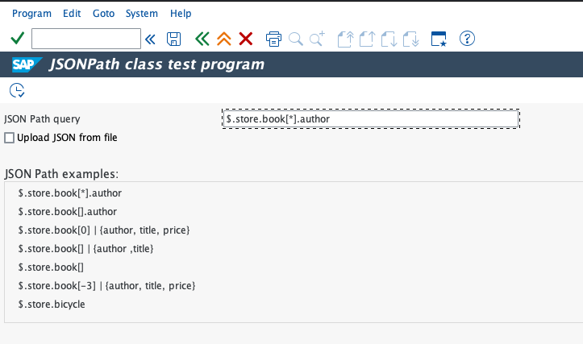
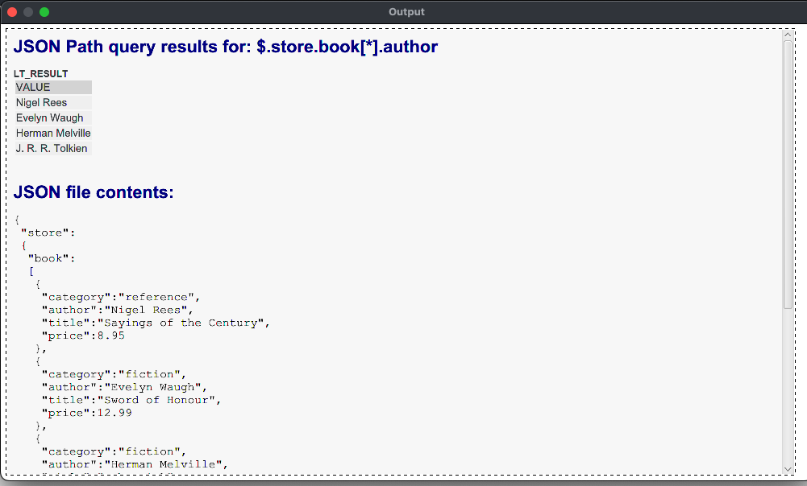

# ABAP JSONPath Implementation

This project provides a simple yet powerful JSONPath implementation for SAP ABAP, allowing you to query and extract data from complex JSON structures using familiar JSONPath syntax.

## Features

- **Standard JSONPath Syntax**: Supports common JSONPath operators for accessing JSON objects and arrays.
- **Object and Array Navigation**:
  - Access object properties using dot-notation (`$.store.book`).
  - Access array elements by index (`$.store.book[0]`).
- **Advanced Querying**:
  - **Wildcard (`*`)**: Get all elements in an array (`$.store.book[*]`).
  - **Array Slicing (`[]`)**: A convenient alternative to the wildcard (`$.store.book[]`).
  - **Object Projection (`{...}`)**: Select specific fields from an object (`{author, title}`).
  - **Pipe Operator (`|`)**: Chain multiple JSONPath expressions together for more complex queries.
- **Error Handling**: Custom exception class `zcx_jsonpath_error` for robust error management.
- **Easy to Use**: A single class `zcl_jsonpath` with a straightforward `evaluate` method.

## Requirements

- SAP ABAP 7.50 or higher.
- The `/UI2/CL_JSON` class for JSON serialization/deserialization.

## How to Use

To use the JSONPath class in your ABAP reports or classes, follow these steps:

1.  **Create the Exception Class**: Create a new exception class named `zcx_jsonpath_error` in your system. You can copy the code from `zcx_jsonpath_error.abap`.
2.  **Create the JSONPath Class**: Create a new class named `zcl_jsonpath` and copy the code from `zcl_jsonpath.abap`.
3.  **Instantiate and Use**: In your code, create an instance of `zcl_jsonpath` and call the `evaluate` method with your JSON string and JSONPath expression.

### Example

Here is an example of how to use the class in a simple report:

```abap
*&---------------------------------------------------------------------*
*& Report zjsonpath_test
*&---------------------------------------------------------------------*
*& Test program for ABAP JSON Path class zcl_jsonpath
*&---------------------------------------------------------------------*
REPORT zjsonpath_test.

PARAMETERS: p_path TYPE string LOWER CASE DEFAULT '$.store.book[*].author',
            p_file AS CHECKBOX.

SELECTION-SCREEN SKIP.
SELECTION-SCREEN BEGIN OF BLOCK b1 WITH FRAME TITLE TEXT-t01.
  SELECTION-SCREEN COMMENT /1(50) TEXT-ex1.
  SELECTION-SCREEN COMMENT /1(50) TEXT-ex2.
  SELECTION-SCREEN COMMENT /1(50) TEXT-ex3.
  SELECTION-SCREEN COMMENT /1(50) TEXT-ex4.
  SELECTION-SCREEN COMMENT /1(50) TEXT-ex5.
  SELECTION-SCREEN COMMENT /1(50) TEXT-ex6.
  SELECTION-SCREEN COMMENT /1(50) TEXT-ex7.
SELECTION-SCREEN END OF BLOCK b1.

CONSTANTS:
  lc_file_filter TYPE string VALUE 'JSON Files (*.json)|*.json|All Files (*.*)|*.*'.

DATA:
  lt_file   TYPE STANDARD TABLE OF char1024,
  lv_json   TYPE string,
  lv_file   TYPE string,
  lt_files  TYPE filetable,
  lv_rc     TYPE i,
  lv_action TYPE i.

IF p_file EQ abap_true.

  cl_gui_frontend_services=>file_open_dialog(
    EXPORTING
      window_title            = 'Select JSON File'
      default_extension       = 'json'
      file_filter             = lc_file_filter
      initial_directory       = '/Users/ew_eki/Developer/abap/jsonPathwithABAP'
    CHANGING
      file_table              = lt_files
      rc                      = lv_rc
      user_action             = lv_action
    EXCEPTIONS
      file_open_dialog_failed = 1
      cntl_error              = 2
      error_no_gui            = 3
      not_supported_by_gui    = 4
      OTHERS                  = 5
  ).
  IF sy-subrc NE 0.
    MESSAGE ID sy-msgid TYPE sy-msgty NUMBER sy-msgno
      WITH sy-msgv1 sy-msgv2 sy-msgv3 sy-msgv4.
  ENDIF.

  IF lv_action EQ cl_gui_frontend_services=>action_cancel.
    MESSAGE s050(/ltb/tr_ui).
    RETURN.
  ENDIF.

  lv_file = VALUE #( lt_files[ 1 ]-filename OPTIONAL ).

  cl_gui_frontend_services=>gui_upload(
    EXPORTING
      filename                = lv_file
    CHANGING
      data_tab                = lt_file
    EXCEPTIONS
      file_open_error         = 1
      file_read_error         = 2
      no_batch                = 3
      gui_refuse_filetransfer = 4
      invalid_type            = 5
      no_authority            = 6
      unknown_error           = 7
      bad_data_format         = 8
      header_not_allowed      = 9
      separator_not_allowed   = 10
      header_too_long         = 11
      unknown_dp_error        = 12
      access_denied           = 13
      dp_out_of_memory        = 14
      disk_full               = 15
      dp_timeout              = 16
      not_supported_by_gui    = 17
      error_no_gui            = 18
      OTHERS                  = 19
  ).

  IF sy-subrc NE 0.
    MESSAGE ID sy-msgid TYPE sy-msgty NUMBER sy-msgno
      WITH sy-msgv1 sy-msgv2 sy-msgv3 sy-msgv4.
  ENDIF.

  " Convert internal table to json string
  lv_json = REDUCE string( INIT s = VALUE string(  ) FOR <line> IN lt_file NEXT s = s && <line> ).

ELSE.
  lv_json =
    `{ "store": { "book": [ { "category": "reference", "author": "Nigel Rees",` &&
    ` "title": "Sayings of the Century", "price": 8.95 },` &&
    `{ "category": "fiction", "author": "Evelyn Waugh", "title": "Sword of Honour", "price": 12.99 },` &&
    `{ "category": "fiction", "author": "Herman Melville", "title": "Moby Dick",` &&
    ` "isbn": "0-553-21311-3", "price": 8.99 },` &&
    `{ "category": "fiction", "author": "J. R. R. Tolkien", "title": "The Lord of the Rings",` &&
    ` "isbn": "0-395-19395-8", "price": 22.99 } ],` &&
    `"bicycle": { "color": "red", "price": 19.95 } } }`.
ENDIF.

CHECK lv_json IS NOT INITIAL.

DATA(jsonpath) = NEW zcl_jsonpath( ).
TRY.
    DATA(lt_result) = jsonpath->evaluate( iv_json = lv_json iv_jsonpath = p_path ).

    cl_demo_output=>begin_section( |JSON Path query results for: { p_path }| ).
    cl_demo_output=>write_data( lt_result ).
    cl_demo_output=>end_section( ).

    cl_demo_output=>begin_section( 'JSON file contents:' ).
    cl_demo_output=>display_json( lv_json ).
    cl_demo_output=>end_section( ).

    cl_demo_output=>display( ).

  CATCH zcx_jsonpath_error INTO DATA(error).
    cl_demo_output=>display( |ERROR: { error->if_message~get_text( ) }| ).
ENDTRY.

**********************************************************************
```

#### Text Elements and Selection Texts for the test program zjsonpath_test

```
EX1	$.store.book[*].author
EX2	$.store.book[].author
EX3	$.store.book[0] | {author, title, price}
EX4	$.store.book[] | {author ,title}
EX5	$.store.book[]
EX6	$.store.book[-3] | {author, title, price}
EX7	$.store.bicycle
T01	JSON Path examples:

P_FILE	Upload JSON from file
P_PATH	JSON Path query
```





## How It Works

The implementation consists of two main private methods:

- `parse_path`: This method takes a JSONPath string and transforms it into a standardized internal format. It uses regular expressions to handle different JSONPath operators and splits the path into segments.
- `navigate`: A recursive method that traverses the deserialized ABAP data structure according to the parsed path segments. It handles object and array navigation, wildcards, and projections.

## Contributing

Feel free to fork this project, suggest improvements, or submit pull requests to enhance its functionality.
